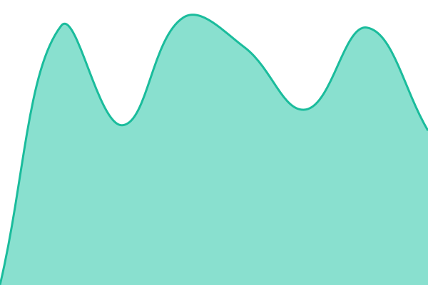

# [📈 Live Status](https://status.halalstack.app): <!--live status--> **Tous les services fonctionnent**

This repository contains the open-source uptime monitor and status page for [benamorwael](https://status.halalstack.app), powered by [Upptime](https://github.com/upptime/upptime).

With [Upptime](https://upptime.js.org), you can get your own unlimited and free uptime monitor and status page, powered entirely by a GitHub repository. We use [Issues](https://github.com/benamor001/halalstack-upptime/issues) as incident reports, [Actions](https://github.com/benamor001/halalstack-upptime/actions) as uptime monitors, and [Pages](https://status.halalstack.app) for the status page.

<!--start: status pages-->
<!-- This summary is generated by Upptime (https://github.com/upptime/upptime) -->
<!-- Do not edit this manually, your changes will be overwritten -->
<!-- prettier-ignore -->
| URL | Status | History | Response Time | Uptime |
| --- | ------ | ------- | ------------- | ------ |
|  [HalalStack Home](https://halalstack.app) | 🟩 Up | [halal-stack-home.yml](https://github.com/benamor001/halalstack-upptime/commits/HEAD/history/halal-stack-home.yml) | 

 1051ms
     
 | 

<a href="https://status.halalstack.app/history/halal-stack-home">100.00%</a>
    

|  [API Health](https://halalstack.app/api/health) | 🟩 Up | [api-health.yml](https://github.com/benamor001/halalstack-upptime/commits/HEAD/history/api-health.yml) | 

 735ms
     
 | 

<a href="https://status.halalstack.app/history/api-health">100.00%</a>
    

|  [API Search](https://halalstack.app/api/search?q=AAPL) | 🟩 Up | [api-search.yml](https://github.com/benamor001/halalstack-upptime/commits/HEAD/history/api-search.yml) | 

 424ms
     
 | 

<a href="https://status.halalstack.app/history/api-search">100.00%</a>
    

|  [Methodology HCS](https://halalstack.app/methodology/hcs) | 🟩 Up | [methodology-hcs.yml](https://github.com/benamor001/halalstack-upptime/commits/HEAD/history/methodology-hcs.yml) | 

 1000ms
     
 | 

<a href="https://status.halalstack.app/history/methodology-hcs">100.00%</a>
    

|  [Sukuk Catalogue](https://halalstack.app/sukuk) | 🟩 Up | [sukuk-catalogue.yml](https://github.com/benamor001/halalstack-upptime/commits/HEAD/history/sukuk-catalogue.yml) | 

 1061ms
     
 | 

<a href="https://status.halalstack.app/history/sukuk-catalogue">100.00%</a>
    

|  [Learn Articles](https://halalstack.app/learn) | 🟩 Up | [learn-articles.yml](https://github.com/benamor001/halalstack-upptime/commits/HEAD/history/learn-articles.yml) | 

 1174ms
     
 | 

<a href="https://status.halalstack.app/history/learn-articles">100.00%</a>
    

|  [AI Advisor](https://halalstack.app/advisor) | 🟩 Up | [ai-advisor.yml](https://github.com/benamor001/halalstack-upptime/commits/HEAD/history/ai-advisor.yml) | 

 1368ms
     
 | 

<a href="https://status.halalstack.app/history/ai-advisor">100.00%</a>
    

|  [Scanner](https://halalstack.app/scanner) | 🟩 Up | [scanner.yml](https://github.com/benamor001/halalstack-upptime/commits/HEAD/history/scanner.yml) | 

 1879ms
     
 | 

<a href="https://status.halalstack.app/history/scanner">100.00%</a>
    

<!--end: status pages-->

[**Visit our status website →**](https://status.halalstack.app)

## 📄 License

- Powered by: [Upptime](https://github.com/upptime/upptime)
- Code: [MIT](./LICENSE) © [Anand Chowdhary](https://anandchowdhary.com)
- Data in the `./history` directory: [Open Database License](https://opendatacommons.org/licenses/odbl/1-0/)
